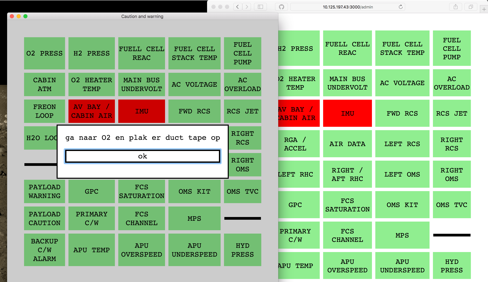

# Caution and Warning

This is a caw system for a space shuttle simulation.

See [jwr-shuttle](http://gh.jwronline.be/jwr-shuttle/)!

# Usage

1. download the executable via [releases](https://github.com/jwronline/caw/releases)
2. Start the executable on the touch screen
3. Connect to `your-ip:3000/admin` as admin to toggle cautions

# License

Apache 2.0
